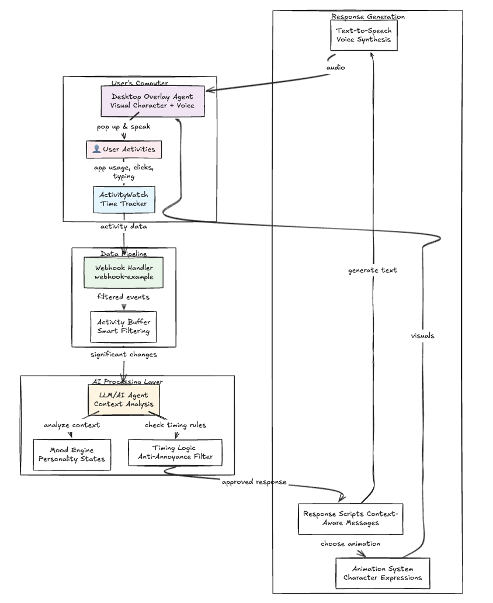

# workpal-agent

## System Architecture

## Folder Descriptions
- `activity-buffer`: Smart filtering service for ActivityWatch data (TypeScript/Node microservice).
- `activitywatch`: Upstream ActivityWatch time-tracking suite included as a git submodule for collecting raw activity data.
- `assets`: Static assets such as diagrams and images used in documentation.
- `screen-overlay`: (WIP) Front-end overlay components for displaying real-time status and controls on screen.
- `smart-response`: Microservice that analyses ActivityWatch data and generates context-aware responses via the agents doodle API.
- `webhook-example-main`: Example Express server that validates signed webhooks and returns demo responses.

## Sample response 

If the user's tabs are tracked as follows within the 30-second window:

> Internship – Summer 2026 at Geneva Trading ‑ Google Chrome – Hrishabh (Work)
> 2025-07-05 14:52:37 [aw-watcher-window-macos] [ERROR] tab title diff: **Job Application for Quantitative Trading Internship – Summer 2026 at Geneva Trading**, window title: *Job Application for Quantitative Trading Internship – Summer 2026 at Geneva Trading ‑ Google Chrome – Hrishabh (Work)*
> 2025-07-05 14:52:38 [aw-watcher-window-macos] [ERROR] tab title diff: **New Tab**, window title:
> 2025-07-05 14:53:00 [aw-watcher-window-macos] [ERROR] tab title diff: **New Tab**, window title: *hackathon.dreamnet.io ‑ Google Chrome – Hrishabh (Work)*
> 2025-07-05 14:53:00 [aw-watcher-window-macos] [ERROR] tab title diff: **New Tab**, window title: *New Tab ‑ Google Chrome – Hrishabh (Work)*
> 2025-07-05 14:53:06 [aw-watcher-window-macos] [ERROR] tab title diff: **Backpack**, window title:  – Hrishabh (Work)
> 2025-07-05 14:53:06 [aw-watcher-window-macos] [ERROR] tab title diff: **Backpack**, window title: *Backpack – Hrishabh (Work)*

Then the agent's response (DEYSI THE VERDANT VIBE) would something like this 

Oh, looking for an internship, are we? Well, let me tell you, sweetstem, the corporate world is a lot like a garden. You've got to plant your seeds, nurture them with a little magic and moxie, and then watch them bloom into something fabulous. *She twirls her leafboard, sending a shower of glowing pollen into the air.* But be careful not to get too tangled in the weeds, or you might just lose your sparkle. So, tell me, what kind of chromatic chaos are you hoping to cultivate with this internship?
